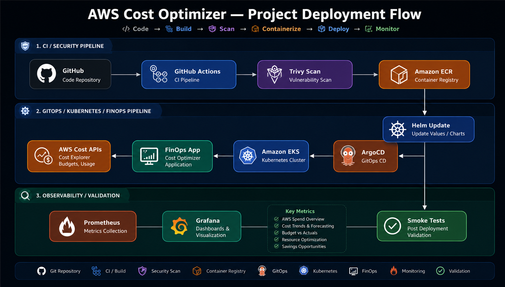

# 💰 AWS Cost Optimizer — Enterprise FinOps Platform

<p align="center">
  <strong>Automated AWS Cost Visibility • Resource Optimization • Kubernetes • GitOps • Observability</strong>
</p>

<p align="center">
  
  
  
  
  
  
</p>

<p align="center">
  
  
  
  
  
</p>

> A production-oriented FinOps platform that connects AWS cost data, resource inventory, optimization recommendations, containerized services, Kubernetes deployment, GitHub Actions CI/CD, ArgoCD GitOps, and Prometheus/Grafana observability into one workflow.

---
### 🌐 [Live Demo →](https://aws-cost-optimizer-nw25-b6k0x8v7e.vercel.app/)

### 🚀 Project Deployment Flow:



## 🚀 Core FinOps & DevOps Stack

<p align="center">
  
  
  
  
  
  
</p>

<p align="center">
  <strong>AWS • Terraform • Docker • Kubernetes • GitHub Actions • Helm</strong>
</p>

---

## 🔐 Security & DevSecOps

<p align="center">
  
</p>

<p align="center">
  <strong> • Trivy</strong>
</p>

---

## ☸️ Kubernetes & Cloud

<table align="center">
  <tr>
    <td align="center">
      
    </td>
    <td align="center">
      
    </td>
    <td align="center">
      
    </td>
    <td align="center">
      
    </td>
  </tr>
</table>

<p align="center">
  <strong>Amazon EKS • Helm • ArgoCD • Amazon ECR</strong>
</p>


## 💰 FinOps & AWS Cost Intelligence

<table align="center">
  <tr>
    <td align="center">
      
    </td>
  </tr>
</table>

<p align="center">
  <strong>AWS Cost Explorer • AWS Budgets • AWS Resource APIs • Boto3</strong>
</p>


## 📊 Monitoring & Observability

<p align="center">
  
  
</p>

<p align="center">
  <strong>Prometheus • Grafana • Kubernetes Metrics • Application Monitoring</strong>
</p>


## ⚙️ Application Stack

<p align="center">
  
  
  
  
</p>

<p align="center">
  <strong>Python • FastAPI • React • JavaScript • REST APIs</strong>
</p>

## 🚀 Why This Project?

AWS environments can accumulate unnecessary spend through idle resources, oversized infrastructure, unexpected service usage, and weak cost visibility.

**AWS Cost Optimizer** provides a centralized way to inspect cloud spend and infrastructure signals, surface optimization opportunities, and run the platform itself on a production-style AWS + Kubernetes stack.

The application integrates with AWS Cost Explorer and AWS Budgets to provide cost summaries, service-level spend, daily trends, forecasts, and budget status information.

---

## ✨ Key Capabilities

### 💵 Cost Intelligence

* Month-to-date AWS cost visibility
* Previous-month cost comparison
* End-of-month cost forecasting
* Top AWS services by spend
* 30-day daily cost trend
* AWS Budget utilization and alert status
* Cost and budget data exposed through backend APIs

### 🔎 Resource Visibility & Optimization

* AWS resource inventory through the backend service layer
* Recommendations endpoint for optimization insights
* FinOps-oriented dashboard for centralized visibility
* API-driven architecture for extending optimization rules and reporting

### ☁️ Production Cloud Infrastructure

* AWS VPC with public/private subnets
* Amazon EKS cluster
* Managed worker node group
* AWS Load Balancer Controller
* Amazon ECR repositories for application images
* IAM + OIDC/IRSA integration for Kubernetes workloads
* Terraform-managed infrastructure

### 🔐 DevSecOps & CI/CD

* GitHub Actions based CI/CD pipeline
* Docker image builds for backend and frontend
* Trivy container security scanning
* Amazon ECR image publishing
* Commit SHA image tagging
* Automated Helm image tag updates
* ArgoCD deployment and health synchronization
* Post-deployment smoke tests

### 📊 Observability

* Prometheus metrics collection
* Grafana dashboards
* Kubernetes workload monitoring
* Application health validation
* Production-oriented deployment visibility

---

## 🏗️ High-Level Architecture

```text
                         ┌───────────────────┐
                         │      Developer    │
                         └─────────┬─────────┘
                                   │ git push
                                   ▼
                         ┌───────────────────┐
                         │   GitHub Actions  │
                         │                   │
                         │  Build            │
                         │  Trivy Scan       │
                         │  Push to ECR      │
                         │  Update Helm      │
                         └─────────┬─────────┘
                                   │
                                   ▼
                         ┌───────────────────┐
                         │     Amazon ECR     │
                         │  backend/frontend  │
                         └─────────┬─────────┘
                                   │ image
                                   ▼
                         ┌───────────────────┐
                         │      ArgoCD       │
                         │   GitOps Sync     │
                         └─────────┬─────────┘
                                   │
                                   ▼
              ┌────────────────────────────────────┐
              │          Amazon EKS Cluster         │
              │                                    │
              │  ┌────────────┐  ┌──────────────┐ │
              │  │ React/Nginx│  │   FastAPI    │ │
              │  │  Frontend  │  │   Backend    │ │
              │  └────────────┘  └──────┬───────┘ │
              │                         │         │
              │                       AWS APIs    │
              └────────────────────────┼─────────┘
                                       │
                 ┌─────────────────────┼─────────────────────┐
                 │                     │                     │
                 ▼                     ▼                     ▼
        ┌────────────────┐   ┌────────────────┐   ┌────────────────┐
        │ AWS Cost       │   │ AWS Budgets    │   │ AWS Resources  │
        │ Explorer       │   │                │   │ APIs           │
        └────────────────┘   └────────────────┘   └────────────────┘

                 ┌────────────────────────────────────┐
                 │ Prometheus + Grafana               │
                 │ Monitoring / Dashboards / Metrics  │
                 └────────────────────────────────────┘
```

---

## 🔄 End-to-End Delivery Flow

```text
Developer
   │
   ▼
GitHub
   │
   ▼
GitHub Actions
   │
   ├── Build Backend Image
   ├── Build Frontend Image
   ├── Trivy Security Scan
   ├── Push Images → Amazon ECR
   │
   ▼
Update Helm image tags
   │
   ▼
Git commit / push
   │
   ▼
ArgoCD
   │
   ├── Refresh Application
   ├── Auto-Sync
   └── Wait for Healthy State
   │
   ▼
Amazon EKS
   │
   ▼
AWS ALB
   │
   ▼
FinOps Dashboard + API
   │
   ▼
Smoke Tests ✅
```

---

## 🔐 Security Pipeline

The CI pipeline adds security validation before application images are promoted.

```text
Docker Build
     │
     ▼
Trivy Image Scan
     │
     ├── Backend: CRITICAL findings can fail the pipeline
     │
     └── Frontend: HIGH / CRITICAL findings exported as SARIF
     │
     ▼
Amazon ECR
```

---

## 📊 FinOps Data Flow

The backend uses AWS SDK (`boto3`) to query AWS Cost Explorer and AWS Budgets.

```text
                         ┌─────────────────────┐
                         │   AWS Cost Explorer │
                         └──────────┬──────────┘
                                    │
              ┌─────────────────────┼─────────────────────┐
              │                     │                     │
              ▼                     ▼                     ▼
        MTD Spend             Service Spend          Daily Trend
              │                     │                     │
              └─────────────────────┼─────────────────────┘
                                    │
                                    ▼
                         ┌─────────────────────┐
                         │   FastAPI Backend   │
                         └──────────┬──────────┘
                                    │
                         ┌──────────┴──────────┐
                         │                     │
                         ▼                     ▼
                 React Dashboard       Optimization APIs

                         ┌─────────────────────┐
                         │     AWS Budgets     │
                         └──────────┬──────────┘
                                    │
                                    ▼
                         Budget / Forecast Status
```


## 📁 Project Structure

```text
aws-cost-optimizer/
│
├── .github/
│   └── workflows/
│       └── deploy.yml            # CI/CD pipeline
│
├── argocd/
│   ├── application.yaml          # ArgoCD application
│   └── project.yaml              # ArgoCD project
│
├── backend/
│   ├── app/
│   │   ├── models/
│   │   ├── routers/
│   │   ├── services/
│   │   │   ├── aws_cost.py      # Cost & budget integration
│   │   │   ├── aws_resources.py  # Resource discovery
│   │   │   └── report_generator.py
│   │   ├── config.py
│   │   └── main.py
│   ├── Dockerfile
│   ├── requirements.txt
│   └── .env.example
│
├── frontend/
│   ├── src/
│   │   ├── components/
│   │   │   ├── charts/
│   │   │   └── tables/
│   │   └── App.tsx
│   ├── Dockerfile
│   ├── nginx.conf
│   └── package.json
│
├── grafana/                     # Grafana configuration
├── helm/                        # Kubernetes Helm charts
├── terraform/                   # AWS infrastructure
├── docker-compose.yml
├── setup.sh
└── README.md
```

## 📸 Screenshots
### 🖥️ Application Dashboard


### ⚙️ GitHub Actions CI/CD Pipeline


### 🚀 ArgoCD GitOps Deployment


## 📊 Monitoring & Observability

- **Prometheus** for real-time metrics collection
- **Grafana** dashboards for Kubernetes and application monitoring
- Monitored **CPU, memory, pods, nodes, and resource utilization**
- Implemented **alerting and health monitoring**
- Enabled observability for **performance tracking and FinOps optimization**


## 🚀 Setup Guide — Step by Step

> **Prerequisites:** `aws` `terraform` `kubectl` `helm` `argocd CLI` `docker` installed

---

### Step 1 — Clone the Repository

```bash
git clone https://github.com/Ujjwal0022/aws-cost-optimizer.git
cd aws-cost-optimizer
```

---

### Step 2 — Configure AWS Credentials

```bash
aws configure
# AWS Access Key ID:     YOUR_KEY
# AWS Secret Access Key: YOUR_SECRET
# Default region:        us-east-1
# Output format:         json
```

---

### Step 3 — Provision Infrastructure (Terraform)

```bash
cd terraform
terraform init
terraform plan
terraform apply    # ~15 minutes
cd ..
```

**Creates:**
- ✅ VPC (public + private subnets)
- ✅ EKS Cluster `finops-eks` — 2x t3.medium nodes
- ✅ ECR Repository `finops-app`
- ✅ IAM Roles for EKS + nodes
- ✅ AWS ALB Ingress Controller

---

### Step 4 — Connect to EKS

```bash
aws eks update-kubeconfig --region us-east-1 --name finops-eks
kubectl get nodes    # Should show Ready
```

---

### Step 5 — Install ArgoCD + Prometheus + Grafana

```bash
# ArgoCD
kubectl create namespace argocd
kubectl apply -n argocd -f https://raw.githubusercontent.com/argoproj/argo-cd/stable/manifests/install.yaml
kubectl rollout status deploy/argocd-server -n argocd

# Get ArgoCD Password
kubectl get secret argocd-initial-admin-secret -n argocd \
  -o jsonpath="{.data.password}" | base64 -d

# Prometheus + Grafana
helm repo add prometheus-community https://prometheus-community.github.io/helm-charts
helm repo update
helm upgrade --install prometheus prometheus-community/kube-prometheus-stack \
  --namespace monitoring --create-namespace --wait
```

---

### Step 6 — Add GitHub Secrets

Go to: `GitHub Repo → Settings → Secrets → Actions → New secret`

| Secret | Value |
|--------|-------|
| `AWS_ACCESS_KEY_ID` | Your AWS access key |
| `AWS_SECRET_ACCESS_KEY` | Your AWS secret key |
| `AWS_REGION` | `us-east-1` |
| `ECR_REGISTRY` | `ACCOUNT.dkr.ecr.us-east-1.amazonaws.com` |
| `ARGOCD_SERVER` | ArgoCD LoadBalancer URL |
| `ARGOCD_PASSWORD` | From Step 5 output |

---

### Step 7 — Build & Push Docker Image to ECR

```bash
# ECR Login
aws ecr get-login-password --region us-east-1 | docker login \
  --username AWS \
  --password-stdin YOUR_ACCOUNT_ID.dkr.ecr.us-east-1.amazonaws.com

# Build & Push Frontend
docker build -t YOUR_ACCOUNT_ID.dkr.ecr.us-east-1.amazonaws.com/finops-app:latest ./frontend
docker push YOUR_ACCOUNT_ID.dkr.ecr.us-east-1.amazonaws.com/finops-app:latest

# Build & Push Backend
docker build -t YOUR_ACCOUNT_ID.dkr.ecr.us-east-1.amazonaws.com/finops-backend:latest ./backend
docker push YOUR_ACCOUNT_ID.dkr.ecr.us-east-1.amazonaws.com/finops-backend:latest
```

---

### Step 8 — Deploy with Helm

```bash
helm install finops helm/finops/ \
  --namespace finops \
  --create-namespace \
  --set image.repository=YOUR_ACCOUNT_ID.dkr.ecr.us-east-1.amazonaws.com/finops-app \
  --set image.tag=latest
```

---

### Step 9 — Apply ArgoCD App (GitOps)

```bash
kubectl apply -f argocd/project.yaml
kubectl apply -f argocd/application.yaml
```

ArgoCD will now **auto-sync** on every `git push origin main` 🔄

---

### Step 10 — Push & Trigger CI/CD

```bash
git add .
git commit -m "deploy: initial setup"
git push origin main
```

**GitHub Actions pipeline runs automatically:**

---

### Step 11 — Verify Deployment

```bash
# Check pods
kubectl get pods -n finops
kubectl get pods -n monitoring

# Check services
kubectl get svc -n finops

# Get ALB URL
kubectl get ingress -n finops
```

---

### Access Services

| Service | URL |
|---------|-----|
| FinOps Dashboard | `http://<ALB-DNS>/` |
| API Docs | `http://<ALB-DNS>/api/docs` |
| ArgoCD | `https://<ARGOCD-LB>/` |
| Grafana | `http://<ALB-DNS>/grafana` (admin/prom-operator) |
| Prometheus | `http://<ALB-DNS>/prometheus` |

---

### 🧹 Cleanup

```bash
# Delete Kubernetes resources
helm uninstall finops -n finops
helm uninstall prometheus -n monitoring
kubectl delete namespace argocd finops monitoring

# Destroy AWS infrastructure (saves cost)
cd terraform
terraform destroy
```
## 👨‍💻 Author

**Ujjwal Kumar**

Cloud / DevOps Engineer — AWS • Kubernetes • Terraform • CI/CD • FinOps

GitHub: [@Ujjwal0022](https://github.com/Ujjwal0022)

## ⭐ Support

If this project is useful for learning **AWS, DevOps, Kubernetes, GitOps, or FinOps**, consider giving the repository a ⭐.

<p align="center">
  <strong>Build cloud systems. Automate operations. Optimize cost. 🚀</strong>
</p>
